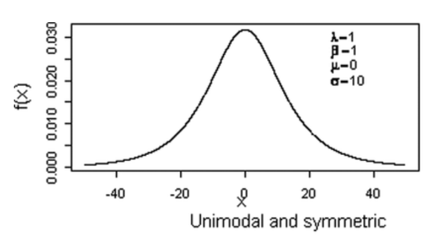
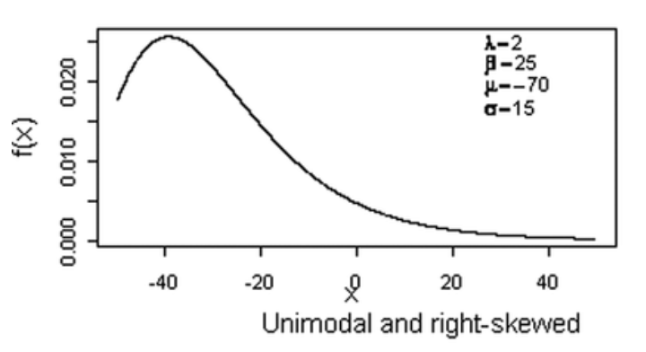
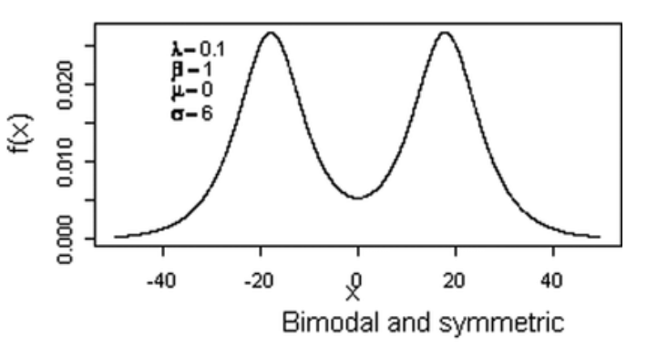

## 🌟 Introduction

The theory of theories—the one that quietly rules the statistical universe—is the Central Limit Theorem. This isn’t an exaggeration; it’s one of the few ideas that has genuinely stood the test of time—one that every researcher and statistician owes a debt to. Although the theorem was being used as far back as the early 1800s, the name Central Limit Theorem (CLT) didn’t appear until the 1920s, thanks to George Pólya. And honestly, he nailed it. Since then, the CLT has truly become the center of our world, proving that its title was both accurate and unintentionally poetic.

Think of learning the CLT as the equivalent of learning the alphabet for statisticians. If you don’t understand the alphabet, you can’t read. And if you don’t understand the CLT, you can’t interpret data in any meaningful way. It’s the foundation for everything—from the simplest tests like t-tests and ANOVAs to the most complex models, including multilevel modeling and machine learning algorithms.

## 🫀The CLT: A Simple Idea with Massive Power

This is exactly why understanding the CLT opens up the entire world of statistics to us It gives us the ammo we need to explore, question, and satisfy our scientific curiosities. With it, we can make predictions, test even the weirdest theories our brains cook up, and ultimately make sense of the world around us.

To me, the Central Limit Theorem feels less like a technical rule and more like a quiet law of the universe—a piece of cosmic truth that somehow (and rightfully) ended up in our statistics textbook. And yes, I know I sound dramatic. But honestly? Spending a few minutes talking about this theorem is time very well spent.

::: {style="text-align: center;"}

:::

#### So what is this cosmic truth?

It starts with the familiar bell curve. We’ve all seen it: tall in the middle, gentle slopes on both sides. And the CLT tells us that behind the scenes of our messy, chaotic, unpredictable world, there is a surprising amount of order.

Take human attitudes and behaviors. These are complicated. Messy. Impossible to pin down. And yet, the CLT helps us measure them, classify them, and make sense of them.

## 🌎 Making Sense of the Messy World Around Us

Let’s imagine you and your friend group believe that staying up all night watching TikTok makes you smarter. You’re learning new things, absorbing information you wouldn’t have learned if you were asleep — so it must be good, right?

Sure… maybe in your friend group.

But is it universally true? Do people across different ages, cultures, and backgrounds share that belief? Or is your friend group just an extreme case?

Naturally, we cannot ask all 8 billion people on Earth. So how can we ever truly know that if something is universally true across the entire population or at least a subsection of it?  That’s where the CLT comes in.

If we surveyed a huge number of people about this belief and plotted the results, the histogram might take any shape:

::: {style="text-align: center;"}

:::

::: {style="font-size: 12px; margin-top: 5px; text-align: center;"}
Source: Kahadawala Cooray, <a href="https://www.researchgate.net/publication/263345601_Exponentiated_Sinh_Cauchy_Distribution_with_Applications">Exponentiated Sinh Cauchy Distribution with Applications</a>
:::

- [It might look like a bell curve]{style="font-weight:bold;"} (if most people are somewhere in the middle).
  - People’s height
  - Test scores on a reasonably challenging exam

::: {style="text-align: center;"}

:::

::: {style="font-size: 12px; margin-top: 5px; text-align: center;"}
Source: Kahadawala Cooray, <a href="https://www.researchgate.net/publication/263345601_Exponentiated_Sinh_Cauchy_Distribution_with_Applications">Exponentiated Sinh Cauchy Distribution with Applications</a>
:::

- [It might be skewed]{style="font-weight:bold;"} (if most people strongly disagree or if there are only a few extreme values).
  - Income (a classic right-skew)
  - Time spent on social media (many low users, a few very heavy users)

::: {style="text-align: center;"}

:::

::: {style="font-size: 12px; margin-top: 5px; text-align: center;"}
Source: Kahadawala Cooray, <a href="https://www.researchgate.net/publication/263345601_Exponentiated_Sinh_Cauchy_Distribution_with_Applications">Exponentiated Sinh Cauchy Distribution with Applications</a>
:::

- [It might even be weirdly shaped]{style="font-weight:bold;"} (because humans are weirdly shaped in their opinions).
  - Political ideology in a polarized environment (bimodal: clusters on the left and right)
  - Daily caffeine consumption (clusters of non-drinkers, 1-cup people, and “five-cups-before-8am” people)

#### 🪄 But here’s the magical part:

No matter what the original distribution looks like—bell-shaped, skewed, or downright weird—the Central Limit Theorem says something remarkable.

<strong>Central Limit Theorem: </strong> If you take repeated random samples, compute their averages, and then plot those averages (the sample means), the distribution of those sample means will form a normal, bell-shaped curve.

And the center of that bell? It will land right on the true population mean—or extremely close to it.

*Note. I know, that’s a lot of “means” and “averages,” but read it twice and let it sink in. It’s worth it.*

Because this idea is huge. It means we can understand something about an entire population without surveying every single person. It means we can make strong, probability-based statements from just a random, representative sample.

[Why?]{style="font-weight: bold"} 
Because once we have that bell-shaped distribution of sample means, we know exactly how the probabilities behave around it—the classic rule: 68% between ±1 SD, 95% between ±2 SD, 99.7% between ±3 SD.

##### In other words: statistics works because the CLT works.

And once we have that predictable bell curve, we can use it to answer our most desired questions, like:

- [Is your friend group’s belief unusual?]{style="font-weight:bold;"}
  - Maybe you and your friends are convinced that pulling all-nighters makes you smarter. But if you looked at a random group of people from different ages, backgrounds, and cultures, would their average opinion be the same as yours?

- [Is the difference meaningful?]{style="font-weight:bold;"}
  - Maybe your sample shows that heavy late-night TikTok users feel more creative the next day. But is that difference large compared to what we’d expect by chance, or would most samples show something similar?

That famous 5% cutoff (p < .05), while admittedly arbitrary, is built entirely on this idea.

If your sample statistic—say, the average belief of your friend group—falls in the most extreme 5% of the sampling distribution (the far tails of that bell curve), then the odds that it came from a world where “nothing special is happening” are pretty slim.

In about 95% of samples, the confidence interval we construct will contain the true population parameter. So when your sample lands way outside the center, it signals that something meaningful might be going on.

Maybe your group is exposed to something the rest of the population isn’t—like:

- [Algorithms that feed you more educational TikToks]{style="font-weight:bold;"} because of your viewing history
- [Higher levels of curiosity or openness]{style="font-weight:bold;"}, making you more likely to interpret TikTok as educational
- [A shared habit of fact-checking or Googling things]{style="font-weight:bold;"} you see on TikTok, turning passive watching into active learning
- [A shared inside joke or belief system]{style="font-weight:bold;"} that reinforces the idea that “TikTok makes you smarter” while that may not be objectively true.

Any of these could pull your group’s average far away from the general population’s average belief. And when your sample falls deep into the tails of that distribution, the CLT gives you the statistical language to say: Something about this group is different.

##### That’s the power of the CLT:

It turns chaos into predictability, letting us use small samples to understand big populations—and giving us the tools to tell flukes from real effects and ultimately help us understand the world through facts and objectivity.

## 👬 Why Bigger Samples Make Better Science

Now, let’s talk about another thing people hear all the time: ["We need a bigger sample size."]{style="font-weight: bold;"} But why? If a sample is a sample, why does it matter if we survey 20 people or 2,000? Here’s where I borrow (read: steal) a fantastic analogy from my PI, Michael Bixter.

Imagine you and your friends are choosing a restaurant for a special dinner. You narrow it down to two options. Both have a 4.9-star average on Google. But:

- One restaurant has 16 reviews
- The other has 61 reviews

Which one would you trust more?

Almost everyone goes with the 61-review restaurant. Why?
Because more people have vetted it. More evidence = more confidence.

The same is true in statistics.

- A sample of 2 people is technically still a sample — but it tells us almost nothing.
- A sample of 2,000 people? Much better.

Mathematically, the error in our estimates literally shrinks as sample size grows because sample size sits in the denominator of the error formula. So larger samples give us estimates that are more precise and more representative of the true population.

In terms of the CLT’s “imaginary histogram of sample means,” the sample with the bigger size will land closer to the true population mean.

##### But a Warning

Large samples can also make tiny, meaningless differences look statistically significant. or instance, a study with thousands of participants might find a difference in test scores of just 0.2 points between two teaching methods — statistically significant, but practically negligible. So as responsible scientists, we look not just at significance but also at effect sizes — because being statistically significant is not the same as being practically important. 

The Central Limit Theorem gives us incredible power — the power to examine human behavior, to test interventions, to measure change, and to uncover truths. But like any power, it needs to be used ethically, transparently, and thoughtfully.

## 🎙️ Conclusion

Most of us who took a statistics class learned about the Central Limit Theorem right at the beginning. But as we moved on to the practical stuff — formulas for t-tests, running analyses in SPSS or R — that memory of CLT became distant and eventually forgotten. But here’s the thing — if you really get CLT, everything else in statistics suddenly clicks. You won’t need to flip through slides or dust off your textbook every time you see a p-value. Not that spaced repetition is bad, but once you understand this, statistics suddenly becomes a piece of cake. You see, it’s not just blindly accepting what past statisticians came up with a century ago — you actually understand the concepts and, in a way, how we make sense of the world.

The Central Limit Theorem is the quiet engine behind almost every claim we make about people, the world, and even the universe. It tells us that even in chaos, there’s structure. It gives us tools to understand complex behaviors without asking every single person on Earth. And it forms the foundation for everything from simple tests to cutting-edge AI models. In every sense, it’s the law of the universe hidden in plain sight. 

So yes — spending a few minutes talking about it (or writing an entire blog post) is, in my opinion, time very well spent.